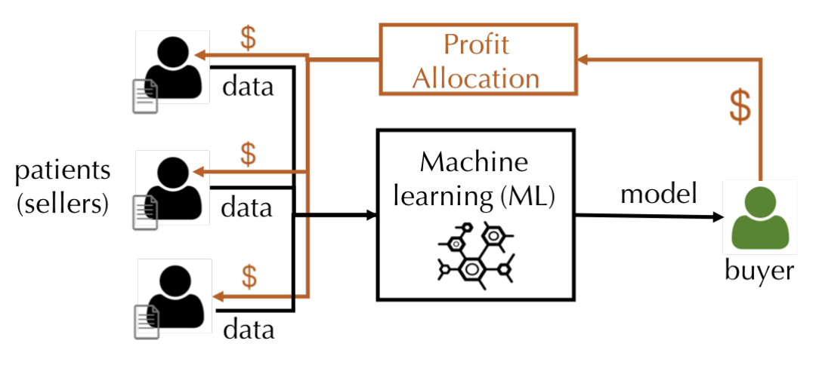
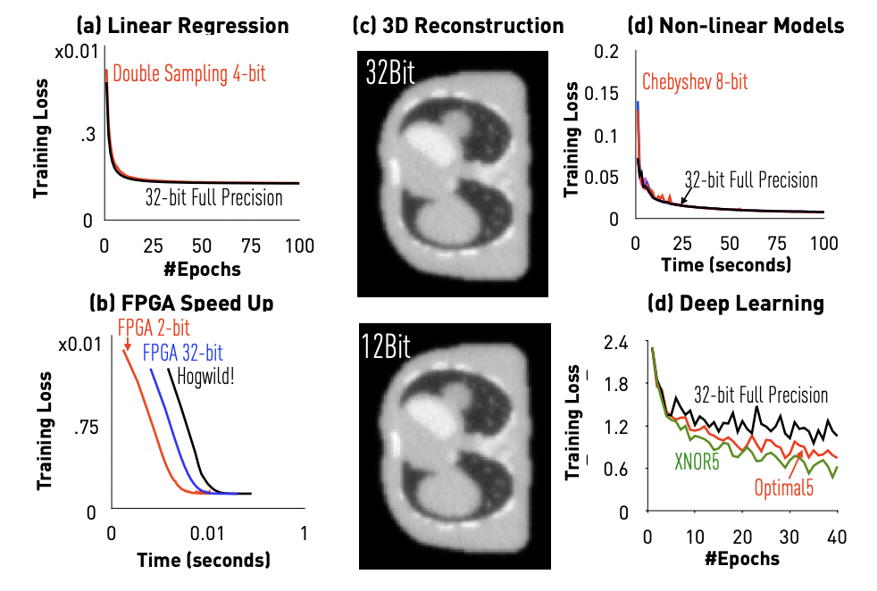

{: .note-title}
>All Publications
>
> A list of All Publications (Chronological Order) can be found [here](./allpublications.html).


## Selected Publications

<div class="code-example" markdown="1">

Binhang Yuan*, Yongjun He*, Jared Quincy Davis, Tianyi Zhang, Tri Dao, Beidi Chen, Percy Liang, Christopher Re, Ce Zhang. Decentralized Training of Foundation Models in Heterogeneous Environments.  **_NeurIPS_** 2022 <span style="color:red">(Oral Presentation 186/9600 = 1.9% submissions)</span>
</div>
```markdown
```

<div class="code-example" markdown="1">

Jue WANG*, Binhang Yuan*, Luka Rimanic, Yongjun He, Tri Dao, Beidi Chen, Christopher Re, Ce Zhang.
Fine-tuning Language Models over Slow Networks using Activation Quantization with Guarantees. **_NeurIPS_** 2022.
</div>
```markdown
```

<div class="code-example" markdown="1">

Shaoduo Gan*, Xiangru Lian*, Rui Wang, Jianbin Chang, Chengjun Liu, Hongmei Shi, Shengzhuo Zhang, Xianghong Li, Tengxu Sun, Jiawei Jiang, Binhang Yuan, Sen Yang, Ji Liu, Ce Zhang. BAGUA: Scaling up Distributed Learning with System Relaxations. **_VLDB_** 2022.
</div>
```markdown
```

<div class="code-example" markdown="1">

Lijie Xu, Shuang Qiu, Binhang Yuan, Jiawei Jiang, Cedric Renggli, Shaoduo Gan, Kaan Kara, Guoliang Li, Ji Liu, Wentao Wu, Jieping Ye, Ce Zhang. In-Database Machine Learning with CorgiPile: Stochastic Gradient Descent without Full Data Shuffle. **_SIGMOD_** 2022.
</div>
```markdown
```

<div class="code-example" markdown="1">

Bojan Karlas*, Peng Li*, Renzhi Wu, Nezihe Merve Gürel, Xu Chu, Wentao Wu, Ce Zhang. Nearest Neighbor Classifiers over Incomplete Information: From Certain Answers to Certain Predictions. **_VLDB_** 2021.
</div>
```markdown
```

<div class="code-example" markdown="1">
Jiawei Jiang*, Shaoduo Gan*, Yue Liu, Fanlin Wang, Gustavo Alonso, Ana Klimovic, Ankit Singla, Wentao Wu, Ce Zhang. Towards Demystifying Serverless Machine Learning Training.  **_SIGMOD_** 2021.
</div>
```markdown
```

<div class="code-example" markdown="1">
Leonel Aguilar, David Dao, Shaoduo Gan, Nezihe Merve Gurel, Nora Hollenstein, Jiawei Jiang, Bojan Karlas, Thomas Lemmin, Tian Li, Yang Li, Susie Rao, Johannes Rausch, Cedric Renggli, Luka Rimanic, Maurice Weber, Shuai Zhang, Zhikuan Zhao, Kevin Schawinski, Wentao Wu, Ce Zhang. Ease.ML: A Lifecycle Management System for Machine Learning.  **_CIDR_** 2021.
</div>
```markdown
```

<div class="code-example" markdown="1">
Peng Li, Xi Rao, Jeffinifer Blase, Yue Zhang, Xu Chu, Ce Zhang. CleanML: A Benchmark for Evaluating the Impact of Data Cleaning on ML Classification Tasks.  **_ICDE_** 2021.
</div>
```markdown
```


<div class="code-example" markdown="1">
Bojan Karlaš, Matteo Interlandi, Cedric Renggli, Wentao Wu, Ce Zhang, Deepak Mukunthu Iyappan Babu, Jordan Edwards, Chris Lauren, Andy Xu and Markus Weimer. Building Continuous Integration Services for Machine Learning.  **_KDD_** 2020 <span style="color:red">(Oral Presentation, Applied Data Science 44/756 = 5.8% submissions)</span>
</div>
```markdown
```


<div class="code-example" markdown="1">
Ruoxi Jia, David Dao, Boxin Wang, Frances Ann Hubis, Nezihe Merve Gurel, Bo Li, Ce Zhang, Costas J. Spanos, Dawn Song. Efficient Task-Specific Data Valuation for Nearest Neighbor Algorithms. **_VLDB_** 2019.
</div>
```markdown
```

<div class="code-example" markdown="1">
Zeke Wang, Kaan Kara, Hantian Zhang, Gustavo Alonso, Onur Mutlu, and Ce Zhang. Accelerating Generalized Linear Models with MLWeaving: A One-Size-Fits-All System for Any-precision Learning. **_VLDB_** 2019.
</div>
```markdown
```

<div class="code-example" markdown="1">
Cedric Renggli, Bojan Karlas, Bolin Ding, Feng Liu, Kevin Schawinski, Wentao Wu, Ce Zhang. Continuous Integration of Machine Learning Models: A Rigorous Yet Practical Treatment. **_SysML_** 2019.
</div>
```markdown
```

<div class="code-example" markdown="1">
Ruoxi Jia, David Dao, Boxin Wang, Frances Ann Hubis, Merve Gurel, Nick Hynes, Bo Li, Ce Zhang, Dawn Song, Costas J. Spanos. Towards Efficient Data Valuation Based on the Shapley Value. **_AISTATS_** 2019.
</div>
```markdown
```

<div class="code-example" markdown="1">
X Lian, Ce Zhang, H Zhang, CJ Hsieh, W Zhang, J Liu. Can Decentralized Algorithms Outperform Centralized Algorithms? A Case Study for Decentralized Parallel Stochastic Gradient Descent. **_NIPS_** 2017. <span style="color:red">(Oral Presentation)</span>
</div>
```markdown
```

<div class="code-example" markdown="1">
H Zhang, J Li, K Kara, D Alistarh, J Liu, Ce Zhang. The ZipML Framework for Training Models with End-to-End Low Precision: The Cans, the Cannots, and a Little Bit of Deep Learning. **_ICML_** 2017.
</div>
```markdown
```

<div class="code-example" markdown="1">
Jaeho Shin, Sen Wu, Feiran Wang, Christopher De Sa, Ce Zhang, and Christopher Re. Incremental knowledge base construction using DeepDive. **_VLDB_** 2015. <span style="color:red">(SIGMOD Research Highlight Award)</span>
</div>
```markdown
```

<div class="code-example" markdown="1">
Ce Zhang, Arun Kumar, and Christopher Re. Materialization optimizations for feature selection workloads. **_SIGMOD_** 2014. <span style="color:red">(SIGMOD Best Paper Award)</span>
</div>
```markdown
```


